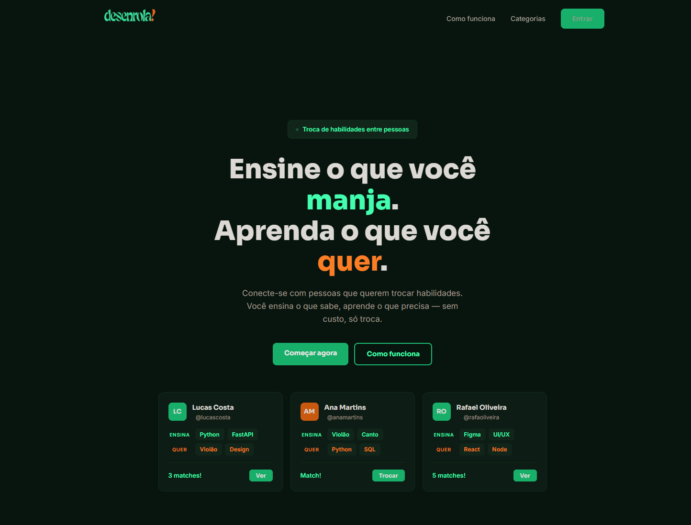
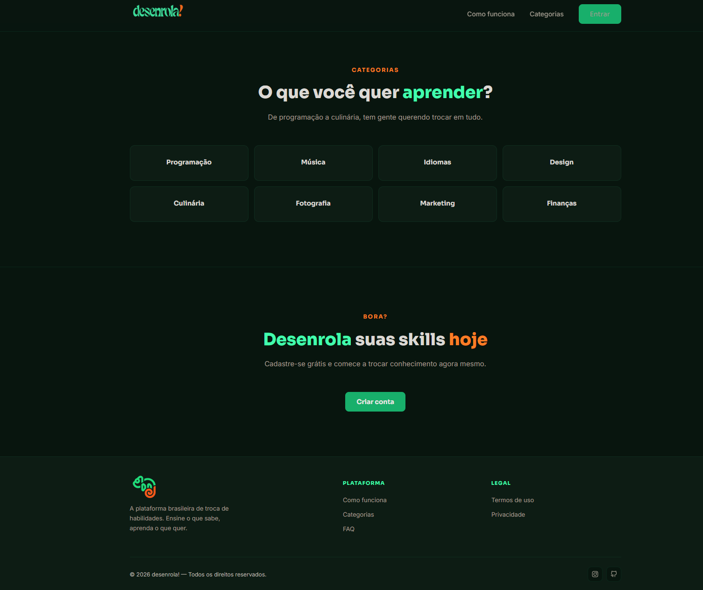
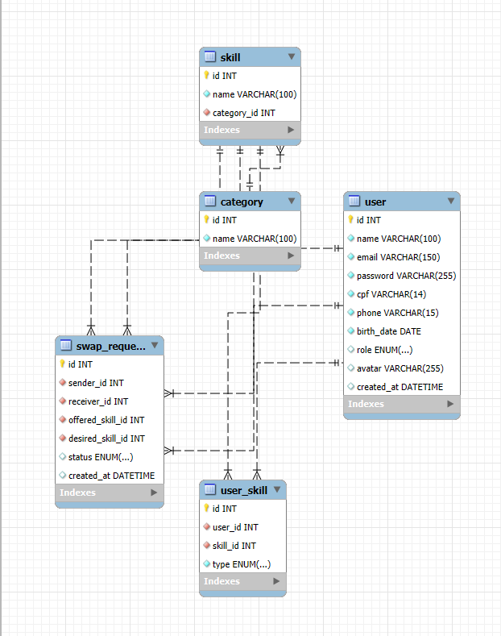

<p align="center">
  
</p>

<p align="center">
  
  
  
  
</p>

<p align="center">
  Plataforma de troca de habilidades entre pessoas.<br>
  Cadastre o que voce sabe, encontre quem sabe o que voce quer aprender e troque conhecimento — sem custo, so troca.
</p>


## Preview

<p align="center">
  
  
</p>


## Modelagem do Banco

<p align="center">
  
</p>


## Funcionalidades

```
🟢 Cadastro e autenticacao de usuarios (Admin e Cliente)
🟢 CRUD completo de usuario (criar, ver, editar, excluir)
🟢 Autenticacao com senha criptografada (bcrypt) e JWT
🟢 Validacao de formularios com RegEx e JavaScript
🟢 Mascaras de input (CPF, telefone)
🟢 Interface responsiva (desktop e mobile)
🟢 Identificacao do usuario autenticado em todas as telas
🟠 Sistema de matching entre usuarios (Sprint 2)
🟠 Solicitacao de troca de habilidades (Sprint 2)
🟠 Upload de avatar (Sprint 2)
🟠 Filtros de pesquisa por categoria (Sprint 2)
```


## Estrutura

```
Desenrola/
├── frontend/
│   ├── index.html
│   ├── register.html
│   ├── login.html
│   ├── profile.html
│   ├── css/
│   │   ├── style.css
│   │   └── app.css
│   ├── js/
│   │   ├── main.js
│   │   ├── validation.js
│   │   ├── auth.js
│   │   ├── register.js
│   │   ├── login.js
│   │   └── profile.js
│   └── assets/images/
├── backend/
│   ├── schema.sql
│   ├── requirements.txt
│   ├── .env
│   └── app/
│       ├── main.py
│       ├── core/
│       │   ├── database.py
│       │   └── auth.py
│       ├── models/
│       │   └── user.py
│       ├── schemas/
│       │   └── user.py
│       ├── routes/
│       │   ├── auth.py
│       │   └── user.py
│       └── services/
└── docs/
    ├── db.png
    ├── Screenshot_1.png
    └── Screenshot_2.png
```


## Como rodar

### Banco de dados
Importe o arquivo `backend/schema.sql` no MySQL Workbench ou execute via terminal:
```bash
mysql -u root -p < backend/schema.sql
```

### Backend
```bash
cd backend
python -m venv venv
venv\Scripts\activate
pip install -r requirements.txt
uvicorn app.main:app --reload
```

### Frontend
Abra `frontend/index.html` no navegador.
