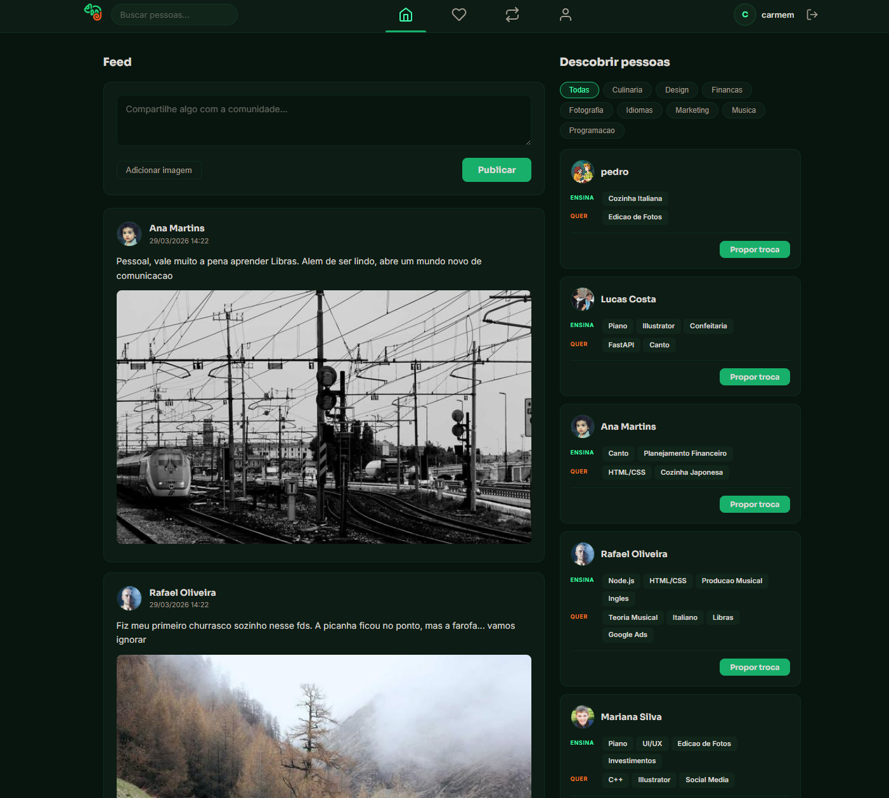

<p align="center">
  
</p>

<p align="center">
  
  
  
  
  
</p>

<p align="center">
  Plataforma de troca de habilidades entre pessoas.<br>
  Cadastre o que voce sabe, encontre quem sabe o que voce quer aprender e troque conhecimento — sem custo, so troca.
</p>


## Preview

<p align="center">
  
  
  
</p>


## Modelagem do Banco

<p align="center">
  

</p>


## Funcionalidades

```
🟢 Cadastro e autenticacao de usuarios (Admin e Cliente)
🟢 CRUD completo de usuario (criar, ver, editar, excluir)
🟢 Autenticacao com senha criptografada (bcrypt) e JWT
🟢 Validacao de formularios com RegEx e JavaScript
🟢 Mascaras de input (CPF, telefone)
🟢 Interface responsiva (desktop e mobile)
🟢 Identificacao do usuario autenticado em todas as telas
🟠 Sistema de matching entre usuarios (Sprint 2)
🟠 Solicitacao de troca de habilidades (Sprint 2)
🟠 Upload de avatar (Sprint 2)
🟠 Filtros de pesquisa por categoria (Sprint 2)
```


## Estrutura

```
Desenrola/
├── backend/
│   ├── seed.py
│   ├── requirements.txt
│   ├── .env
│   ├── app/
│   │   ├── main.py
│   │   ├── core/
│   │   │   ├── database.py
│   │   │   └── auth.py
│   │   ├── schemas/
│   │   │   └── user.py
│   │   └── routes/
│   │       ├── auth.py
│   │       ├── user.py
│   │       ├── skill.py
│   │       ├── match.py
│   │       ├── swap.py
│   │       ├── feed.py
│   │       ├── post.py
│   │       └── upload.py
│   ├── templates/
│   │   ├── index.html
│   │   ├── login.html
│   │   ├── register.html
│   │   ├── dashboard.html
│   │   ├── onboarding.html
│   │   ├── match.html
│   │   ├── profile.html
│   │   ├── swaps.html
│   │   └── user.html
│   └── static/
│       ├── css/
│       ├── js/
│       └── assets/images/
├── frontend/
└── docs/
```


## Como rodar

### 1. Usuario do MySQL
No Ubuntu o `root` usa `auth_socket` e nao aceita senha via TCP. Crie um usuario dedicado:
```bash
sudo mysql -e "CREATE USER 'desenrola'@'localhost' IDENTIFIED BY 'desenrola123'; GRANT ALL PRIVILEGES ON desenrola.* TO 'desenrola'@'localhost'; FLUSH PRIVILEGES;"
```

### 2. Variaveis de ambiente
Crie o arquivo `backend/.env`:
```env
DB_HOST=localhost
DB_USER=desenrola
DB_PASSWORD=desenrola123
DB_NAME=desenrola
DB_PORT=3306
JWT_SECRET=troque-esta-chave
```

### 3. Backend
```bash
cd backend
python -m venv venv
source venv/bin/activate    # Windows: venv\Scripts\activate
pip install -r requirements.txt
```

### 4. Banco de dados
O `seed.py` cria o database, todas as tabelas e popula com dados de exemplo:
```bash
python seed.py
```

### 5. Subir o servidor
```bash
uvicorn app.main:app --reload
```

### Acessar
Abra `http://localhost:8000` no navegador. O backend serve as paginas via Jinja2.


## Contribuidores

<a href="https://github.com/LGSantarosa">
  
</a>
<a href="https://github.com/Mateuscruz19">
  
</a>
